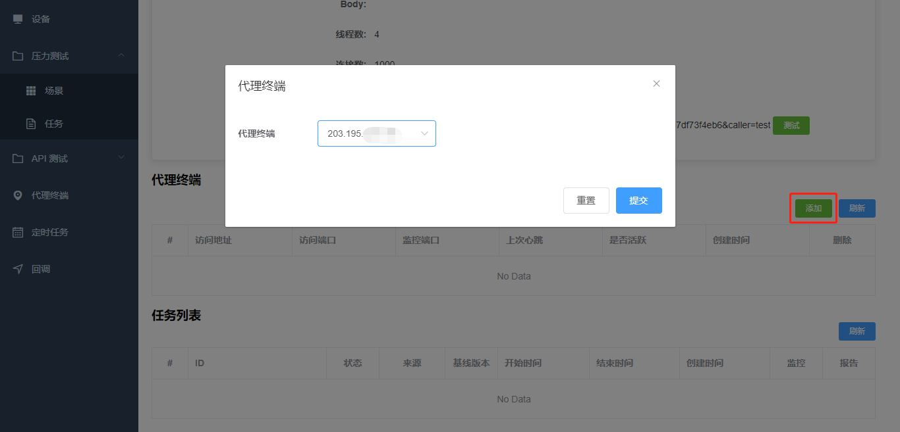

# 代理终端

如果你想在压测过程中观测服务器的资源使用情况，你需要在被测服务器上安装 `Agent`，参考指令：

``` bash
docker run --name testing-agent -d --pid=host \
-e SERVERDOMAIN="{平台地址，如 http://192.168.1.1:5000}" \
-e CLIENTADDRESS="{被测服务器可访问地址，如 192.168.1.2}" \
-e AGENTPORT=5001 \
-e MONITORPORT=5002 \
-p 5001:5001 -p 5002:5002 \
xxx/testing-agent:latest
```

安装成功后，可以在平台查看 Agent 的详细信息：


在压测场景绑定对应的 Agent：



然后在压测过程中就可查看被测服务器的资源使用情况：


