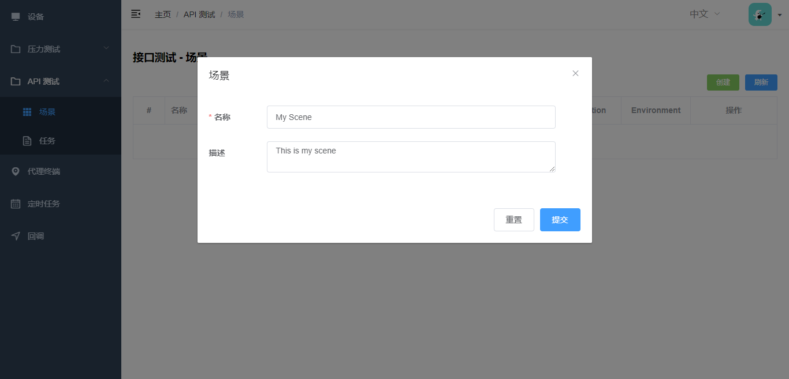
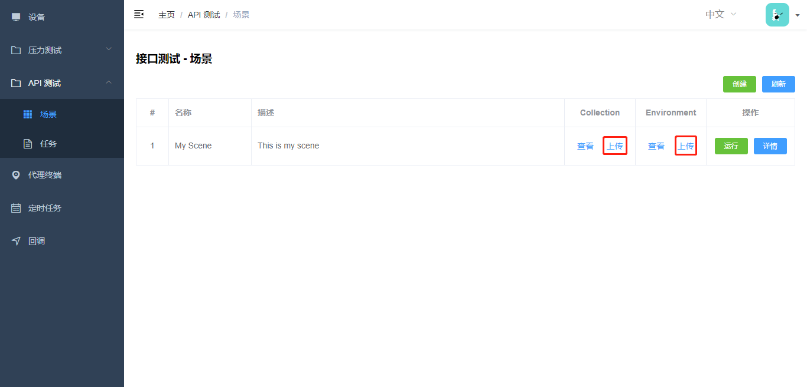
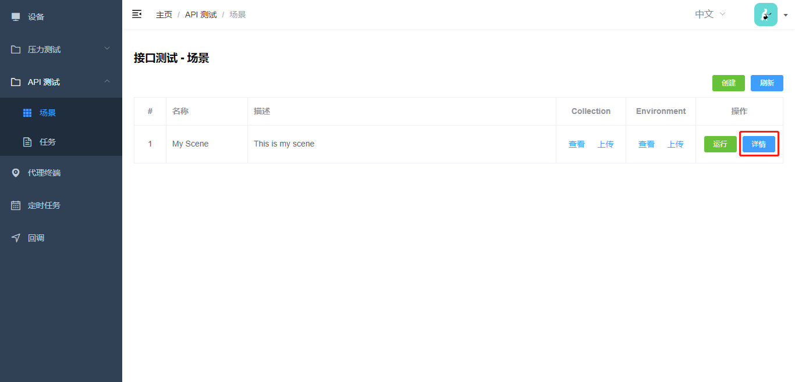
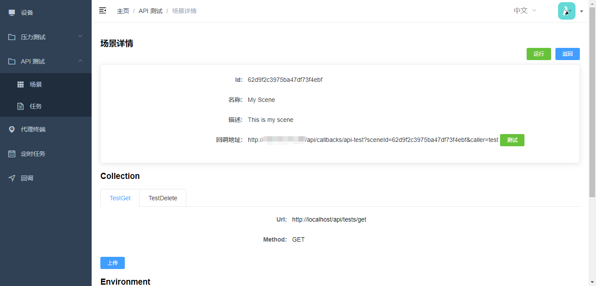
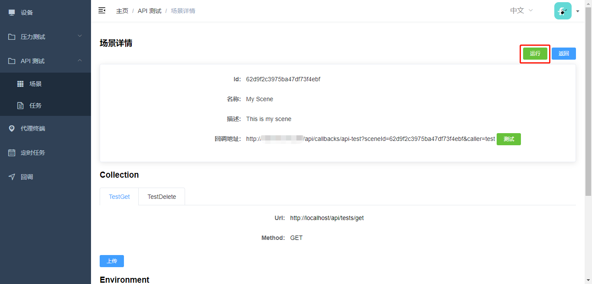
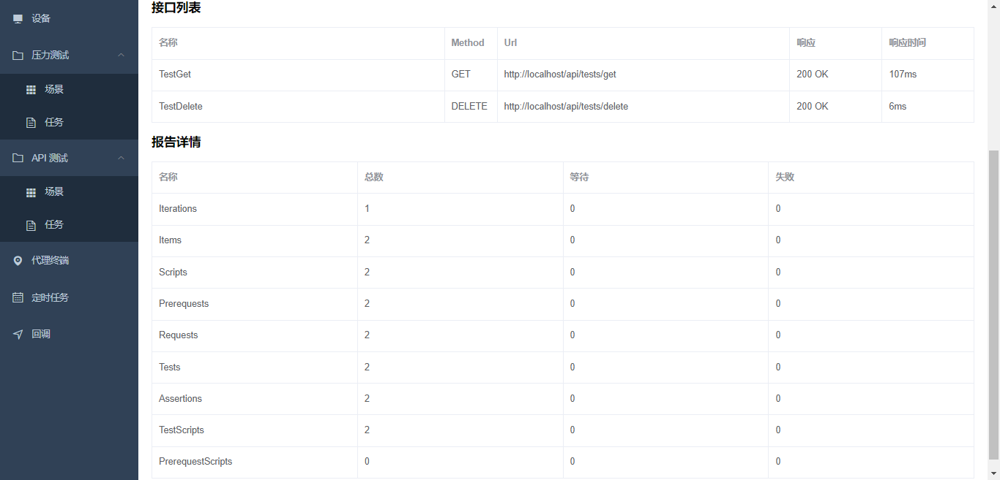

# 接口测试

可以使用 `Postman` 生成 `collection` 及 `environment` 文件，并上传到测试平台转化为接口测试场景。

可以为测试场景设置`定时任务`，实现定期接口自动化测试。

也可以通过`回调`的方式，将接口测试集成到已有的 CICD 流程/工具中。

## 使用步骤

### 新建场景

填写场景名称和场景描述：

### 上传 collection 和 environment 文件

点击`上传`按钮完成 collection 和 environment 文件上传，其中 collection 文件必须上传，environment 可选：

示例：[collection.json](collection.json ':ignore title :target=_blank')

### 查看场景详情

点击`详情`按钮查看场景详情：

### 执行测试

点击`运行`按钮执行测试：

### 查看测试报告

点击`查看`按钮查看测试报告：

