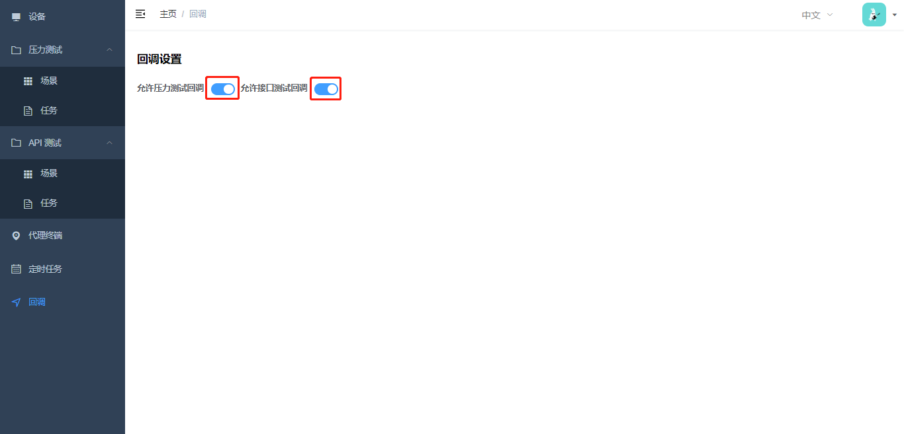
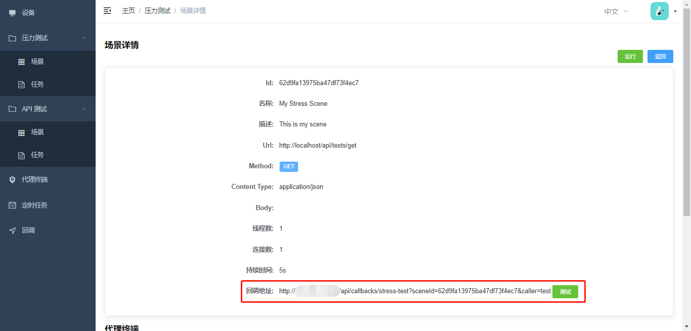
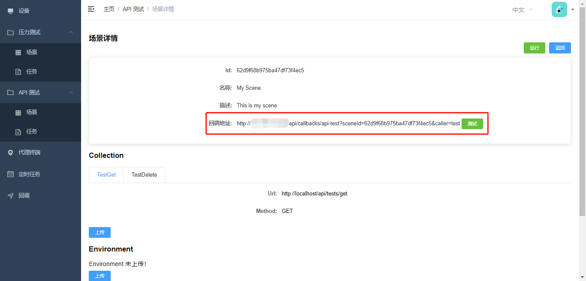
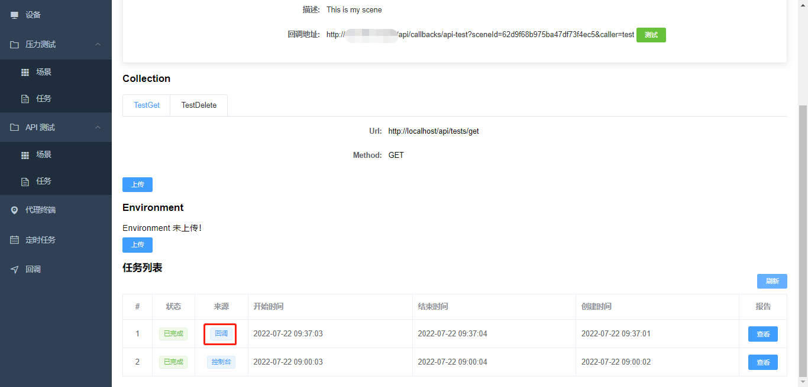

# 回调

`回调`主要用于测试场景与已有的 CICD 流程/工具进行集成，实现解耦。

## 使用步骤

在`回调`页面打开相应的回调设置：

在创建好的测试场景（压力测试或接口测试）详情中，都会带有一个回调地址：

- 压力测试

- 接口测试

可以直接点击`测试`按钮直接查看回调效果：

## 回调地址说明

回调地址的格式为：

http://{domain}/api/callbacks/api-test?sceneId={sceneId}&caller={caller id or url}

或

http://{domain}/api/callbacks/stress-test?sceneId={sceneId}&caller={caller id or url}

其中 caller 参数可以传入类似 jenkins 的构建 url 或者构建 id，实现测试与构建关系绑定，以及使用闭环。
