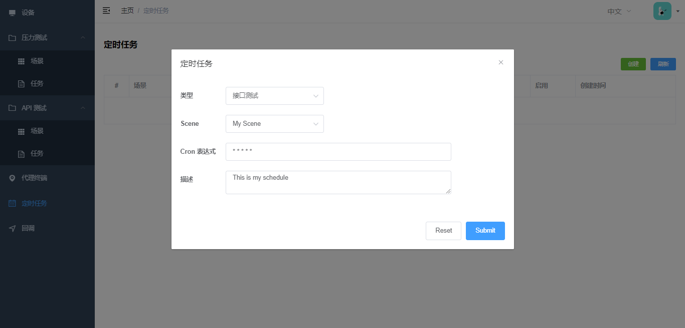
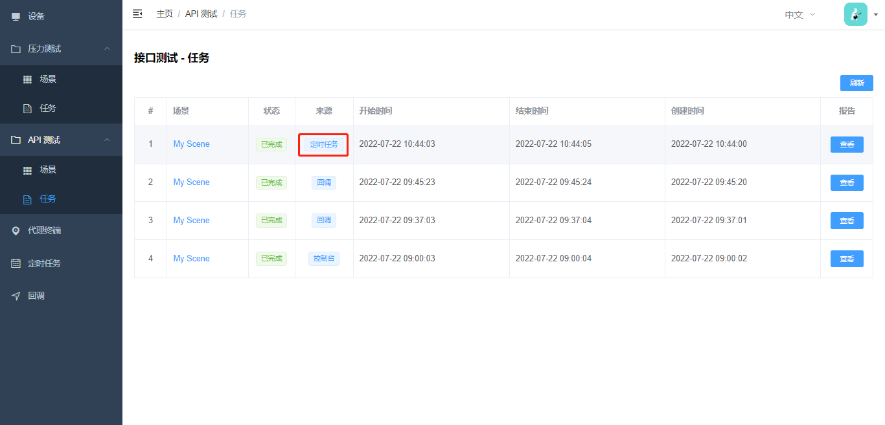
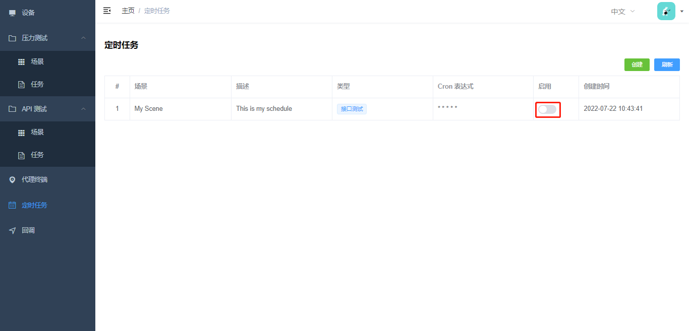

# 定时任务

定时任务可以帮助你定期的执行测试计划，以确保程序是正常稳定的，同时也可以延申一些额外功能，如：告警。

## 使用步骤

### 新建任务

- 类型

选择`压力测试`或者`接口测试`。

- 场景

选择对应的压力测试或接口测试场景。

- Cron 表达式

填写执行测试的执行计划/频率，精确到`分钟`。

### 查看任务执行

可以在 API 测试 - 任务种查看任务执行情况：

### 禁用定时任务

如果定时任务不再需要执行，可以直接在界面上禁用：

