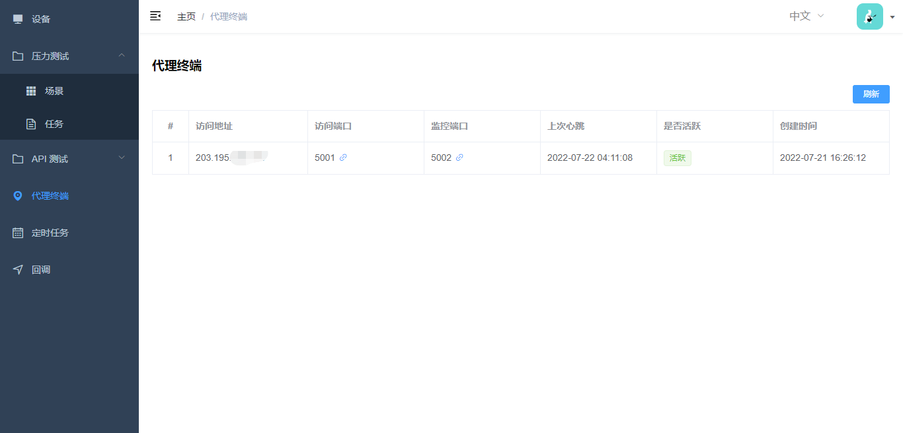

# 压力测试

我们以测试指定服务器的 nginx 性能作为一个示例：


## 使用步骤

### 新建场景


几个关键参数：

- 线程数：4

  因为测试服务器的配置是 1 核 2G，而线程数一般设置成核心数的 2 倍或 4 倍，所以线程数设置为 4。

- 连接数：1000
  
  相当于同时在线人数为 1000。

- 持续时间：60 second

  表示压测时长为 60 秒。

### 安装 Agent （可选）

在被测服务器上安装 Agent，参考指令：

``` bash
docker run --name testing-agent -d --pid=host \
-e SERVERDOMAIN="{平台地址，如 http://192.168.1.1:5000}" \
-e CLIENTADDRESS="{被测服务器可访问地址，如 192.168.1.2}" \
-e AGENTPORT=5001 \
-e MONITORPORT=5002 \
-p 5001:5001 -p 5002:5002 \
xxx/testing-agent:latest
```

安装完成后，Agent 会定时（每 2 秒）发送心跳，平台会基于心跳判断 Agent 是否活跃，可以在`代理终端`页面查看安装了 Agent 的服务器：



### 查看场景详情

点击`详情`按钮查看场景详情：


### 绑定代理终端（可选）

为场景绑定对应的代理终端，在压测时可以方便查看被测服务器的资源使用情况：


### 执行压测

点击`运行`按钮执行压测：


### 查看资源使用


- 测试服务器资源使用情况


- 被测试服务器资源使用情况


- 同时查看


- 资源使用率分析

| 测试服务器使用率 | 被测服务器使用率 | 结论 |
| ------- | ------- | ------ |
| 低 | 低 | 测试服务器测试能力及被测应用性能未到瓶颈 |
| 低 | 高 | 被测应用性能已达瓶颈 |
| 高 | 低 | 1. 受限于测试服务器资源，被测应用无法到达性能瓶颈，<br> 应考虑增加测试服务器资源或分布式压测 <br> 2. 被测应用性能欠佳无法高效使用服务器资源，应考虑优化应用 |
| 高 | 高 | 测试服务器测试能力及被测应用性能基本已达瓶颈 |

### 查看压测报告

点击`查看`按钮查看压测报告：


### 设置基线

可以把具有代表性的压测的结果作为参考基线：


### 压测报告对比

进行多次压力测试，可以对压测报告进行对比：


其中：

- `红色`表示当前测试指标`差于`样本指标（上次结果或基线结果）

- `绿色`表示当前测试指标`优于`样本指标（上次结果或基线结果）
